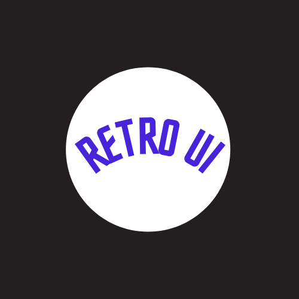

<p align="center">
  <a href="" rel="noopener">
 </a>
</p>

<h3 align="center">Retro UI</h3>

<div align="center">

[]()
[](https://github.com/Naveenchandar/retro-ui/issues)
[](https://github.com/Naveenchandar/retro-ui/pulls)
[](/LICENSE)

</div>

---

<p align="center"> R E T R O - U I.
    <br> 
</p>

## 📝 Table of Contents

- [About](#about)
- [Getting Started](#getting_started)
- [Usage](#usage)
- [List of components](#listofcomponents)
- [Deployment](#deployment)
- [Built Using](#built_using)
- [Authors](#author)
- [Contribution](#contribution)
- [Upcoming Features](#upcomingfeatures)

## 🧐 About <a name = "about"></a>

Retro UI - CSS Component library for faster development. Design, build, and create rapidly with Retro UI's design system.

## Demo
Please visit this [link](https://retro-ui-design.netlify.app/).

## Screenshot

## 🏁 Getting Started <a name = "getting_started"></a>

To run locally, run below command in git terminal.

```
git clone https://github.com/Naveenchandar/retro-ui.git
```
Once done with cloning, Open index.html in browser. You're good to go 🎉.

## 🎈 Usage <a name="usage"></a>

To use this project, Include link mentioned below in head tag of html or using import rule in stylesheet

```
<link rel="stylesheet" href="https://retro-ui-design.netlify.app/css/retro.css" />
                                (or)
@import url ("https://retro-ui-design.netlify.app/css/retro.css")
```
## List of Components <a name="listofcomponents"></a>

- [Alert](https://retro-ui-design.netlify.app/components/alert/alert.html#alert)
- [Avatar](https://retro-ui-design.netlify.app/components/avatar/avatar.html#avatar)
- [Badge](https://retro-ui-design.netlify.app/components/badge/badge.html#badge)
- [Button](https://retro-ui-design.netlify.app/components/button/button.html#button)
- [Card](https://retro-ui-design.netlify.app/components/card/card.html#card)
- [Grid](https://retro-ui-design.netlify.app/components/grid/grid.html#grid)
- [Image](https://retro-ui-design.netlify.app/components/image/image.html#image)
- [Input](https://retro-ui-design.netlify.app/components/input/input.html#input)
- [List](https://retro-ui-design.netlify.app/components/list/list.html#list)
- [Navigation](https://retro-ui-design.netlify.app/components/navigation/navigation.html)
- [Rating](https://retro-ui-design.netlify.app/components/ratings/ratings.html#ratings)
- [Text Utilities](https://retro-ui-design.netlify.app/components/ratings/ratings.html#ratings)

## 🚀 Deployment <a name = "deployment"></a>

- [Netlify](https://www.netlify.com/) - Netlify

## ⛏️ Built Using <a name = "built_using"></a>

- [HTML](https://developer.mozilla.org/en-US/docs/Web/HTML)
- [CSS](https://developer.mozilla.org/en-US/docs/Web/CSS)
- [Javascript](https://developer.mozilla.org/en-US/docs/Web/JavaScript)

## ✍️ Author <a name = "author"></a>

- [@Naveenchandar](https://github.com/Naveenchandar) - Idea & Initial work

## ✍️ Contribution <a name = "contribution"></a>

- Pull requests are welcome. For major changes, please open an issue first to discuss what you would like to change.


## 🎉 Upcoming Features <a name = "upcomingfeatures"></a>

- Dark / Light Mode
- Table Component
- Footer Component
- Label Component
- Pagination Component
- Popover Component
- Progress Component
- Timeline Component
